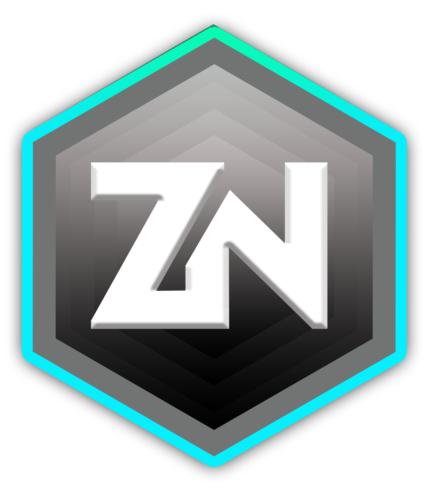
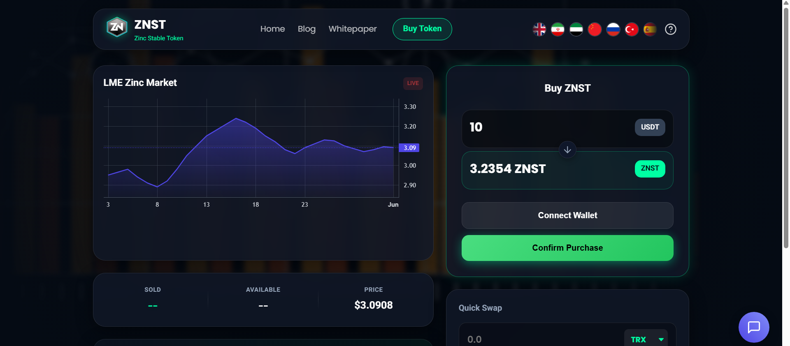
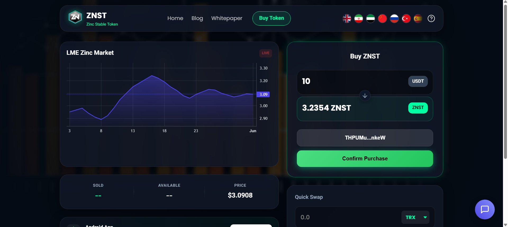
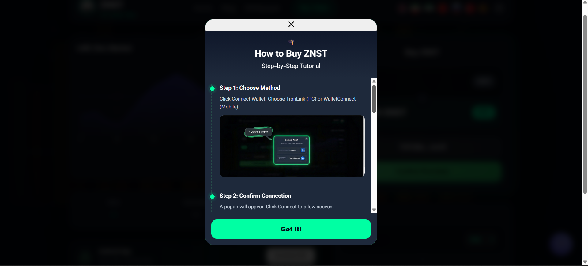
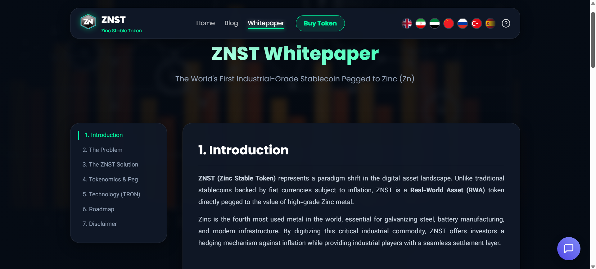

<div align="center">
  

  <h1>FeCoin (ZNST Token)</h1>

  <p><b>LME Zinc Pegged Stablecoin & Web3 Platform</b></p>

  <p>
    A production-ready, decentralized stablecoin pegged to the LME Zinc metal price —<br />
    Featuring Upgradable Smart Contracts, automated oracles, and a multilingual Web/Mobile platform.
  </p>

  <p>
    
    
    
    
    
    
    
  </p>

  <p>
    <a href="#-getting-started">View Repository</a>
    ·
    <a href="https://github.com/arvinameri/FeCoin_V2/issues">Report Bug</a>
    ·
    <a href="https://www.linkedin.com/in/arvinameri">Connect on LinkedIn</a>
  </p>
</div>

---

## 📸 Screenshots

<table>
  <tr>
    <td width="50%">
      
      <p align="center"><b>Homepage</b> — Live Zinc prices & market chart</p>
    </td>
    <td width="50%">
      
      <p align="center"><b>Web3 Connect</b> — TronLink & WalletConnect integration</p>
    </td>
  </tr>
  <tr>
    <td width="50%">
      
      <p align="center"><b>Visual Guide</b> — Step-by-step token purchase process</p>
    </td>
    <td width="50%">
      
      <p align="center"><b>Whitepaper</b> — Comprehensive tokenomics & architecture</p>
    </td>
  </tr>
</table>

---

## 🧭 Overview

**FeCoin (ZNST)** is a fully integrated Web3 platform bridging real-world assets with the Tron blockchain. It introduces a stablecoin dynamically pegged to the daily **London Metal Exchange (LME) Zinc** price.

The platform encompasses an upgradable smart contract architecture, a multilingual Django-based web interface, a React Native mobile application, and a robust Oracle system that automatically syncs blockchain prices with real-world metal market rates.

|                         |                                                                               |
| ----------------------- | ----------------------------------------------------------------------------- |
| 🌍 **7 Languages**      | EN, ES, ZH, RU, AR, TR, FA with dynamic RTL/LTR direction switching           |
| 🔗 **Smart Contracts**  | Upgradable UUPS Pattern (ERC20/TRC20) for ZNST minting and private sales      |
| 🤖 **Automated Oracle** | Node.js & Python scraper automatically fetches LME prices to update the chain |
| 💳 **Web3 Wallets**     | Seamless TronLink integration for direct DApp interactions                    |
| 📱 **Cross-Platform**   | Unified ecosystem spanning Web (Django) and Mobile (React Native / Expo)      |

---

## 🧱 Tech Stack

| Layer               | Technologies                                                    |
| ------------------- | --------------------------------------------------------------- |
| **Backend**         | Python, Django, SQLite, REST API integration                    |
| **Blockchain**      | Solidity, Hardhat, TronWeb, OpenZeppelin (Upgradable Contracts) |
| **Frontend**        | HTML/CSS/JS, Lightweight Charts, Native Web3.js / TronWeb       |
| **Mobile App**      | React Native, Expo, TypeScript                                  |
| **Oracle/Scraping** | Node.js, Python (BeautifulSoup/Requests), JSON Archiving        |
| **i18n**            | Comprehensive multi-language templating and static routing      |

---

## ✨ Key Features

### Blockchain & Smart Contracts

- **ZNST Token:** Standard TRC20 implementation compatible with major Tron wallets.
- **ZNSale Upgradable:** UUPS proxy pattern allowing contract logic upgrades without losing state or user balances.
- **Gas Optimization:** Flattened and verified contracts optimized for the Tron Virtual Machine (TVM).

### Web Platform & Oracle

- **Real-Time Data:** TradingView lightweight charts rendering live Zinc market trends.
- **Automated Price Sync:** `zincClient.ts` and `oracle.py` fetch daily prices and update the sale contract.
- **Multilingual Support:** Dynamic language switching tailored for a global investor base.

---

## 📁 Project Structure

```text
FeCoin_V2/
├── blockchain/               # Smart Contracts & Deployment
│   ├── contracts/            # ZNSTToken.sol, ZNSale_Upgradable.sol
│   ├── scripts/              # Hardhat deployment & upgrade scripts
│   └── hardhat.config.js     # Tron/Nile network configurations
│
├── FeCoin/                   # Core Django Backend
│   ├── settings.py           # Project configs & environments
│   └── templates/            # index.html, whitepaper.html
│
├── ios_app/                  # React Native Mobile App
│   ├── app/                  # Main Expo router views
│   ├── components/           # Reusable UI components
│   └── App.js                # Mobile entry point
│
├── scraper/                  # Node.js Data Oracle
│   └── zincClient.ts         # Automated LME data fetcher
│
├── transactions/             # Django App for User Tracking
│   ├── models.py             # Transaction history schema
│   └── views.py              # API endpoints for web client
│
└── static/                   # Assets, CSS, JS, and UI Guides
```

---

## 🚀 Getting Started

### Prerequisites

- Node.js ≥ 18
- Python ≥ 3.10
- TronLink Wallet Extension
- Git

### 1 — Clone

```bash
git clone https://github.com/arvinameri/FeCoin_V2.git
cd FeCoin_V2
```

### 2 — Environment Setup

Rename the example files to `.env` and fill in your keys:

```bash
cp .env.example .env
cp blockchain/.env.example blockchain/.env
```

### 3 — Backend (Django)

```bash
python -m venv venv
source venv/bin/activate  # On Windows: venv\Scripts\activate
pip install -r requirements.txt
python manage.py migrate
python manage.py runserver
```

\*Access the web app at **http://127.0.0.1:8000***

### 4 — Blockchain (Hardhat)

```bash
cd blockchain
npm install
npx hardhat compile
```

### 5 — Mobile App (Expo)

```bash
cd ios_app
npm install
npx expo start
```

---

## 🔐 Security & Architecture

- **Private Keys Isolated:** All Tron private keys and API credentials are kept strictly in `.env`.
- **Proxy Architecture:** Utilizes OpenZeppelin's `ERC1967Proxy` to ensure safe upgrades.
- **Admin Roles:** `OwnableUpgradeable` prevents unauthorized minting or price manipulation.

---

## 📄 License

This project was developed as a proprietary Web3 solution. Source code is shared for portfolio and demonstration purposes.

---

<div align="center">
  <h3>Built by Arvin Ameri</h3>

  <p>📍 Zanjan, Iran &nbsp;|&nbsp; Full-Stack & Web3 Developer</p>

  <p>
    <a href="https://www.linkedin.com/in/arvinameri">
      
    </a>
    <a href="https://github.com/arvinameri">
      
    </a>
  </p>
</div>
